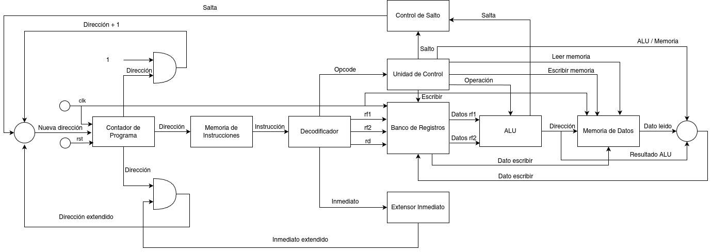

# Procesador monociclo

Autor: Claudio Omar Biale

## Arquitectura propuesta

- Procesador monociclo, basado en arquitectura RISC y Harvard de 16 bits.
- 8 registros de 16 bits (`r0`..`r8`).
- Memoria de instrucciones direccionable de 16 bits con ancho de memoria de 16 bits.
- Memoria de datos direccionable de 16 bits con ancho de memoria de 16 bits.
- Placa objetivo: EDU-CIAA-FPGA

## Software utilizado: 

El software utilizado para el desarrollo del procesador es:
- GHDL.
- GtkWave.
- Imagen de Docker de la EDU-CIAA-FPGA con aplicativos de síntesis.

## Instrucciones del procesador:

| Instrucción        | Descripción                                       |
|--------------------|---------------------------------------------------|
| sum rd, rf1, rf2   | Suma rf1 y rf2, almacena en rd                    |
| sub rd, rf1, rf2   | Resta rf1 de rf2, almacena en rd                  |
| je rf1, rf2, inm   | Salta a pc+inm si rf1 es igual a rf2              |
| jne rf1, rf2, inm  | Salta a pc+inm si rf1 no es igual a rf2           |
| load rd, rf1, rf2  | Carga en rd el valor de la dirección rf1 + rf2    |
| store rd, rf1, rf2 | Almacena en rd el valor de la dirección rf1 + rf2 |
| outh rd            | Envía al puerto USB la parte alta del valor de rd |
| outl rd            | Envía al puerto USB la parte baja del valor de rd |

Formato de instrucciones:

| Instrucción        | opcode | rf1    | rf2    | rd     | 0      |
|--------------------|--------|--------|--------|--------|--------|
| sum rd, rf1, rf2   | 3 bits | 3 bits | 3 bits | 3 bits | 4 bits |
| sub rd, rf1, rf2   | 3 bits | 3 bits | 3 bits | 3 bits | 4 bits |
| load rd, rf1, rf2  | 3 bits | 3 bits | 3 bits | 3 bits | 4 bits |
| store rd, rf1, rf2 | 3 bits | 3 bits | 3 bits | 3 bits | 4 bits |

| Instrucción        | opcode | rf1    | rf2    | inm    |
|--------------------|--------|--------|--------|--------|
| je rf1, rf2, inm   | 3 bits | 3 bits | 3 bits | 7 bits |
| jne rf1, rf2, inm  | 3 bits | 3 bits | 3 bits | 7 bits |

| Instrucción      | opcode | 0      | rd      | 0       |
|------------------|--------|--------|---------|---------|
| outh rd          | 3 bits | 6 bits | 3 bits  | 4 bits  |
| outl rd          | 3 bits | 6 bits | 3 bits  | 4 bits  |

Opcodes:

- sum: 000
- sub: 001
- load: 010
- store: 011
- je: 100
- jne: 101
- outh: 110
- outl: 111

## Esquema del procesador




## Aplicativo ejecutado en el procesador

Contenido de la memoria de instrucciones
```
0100000000000000 -- load r0, r0, r0  carga en r0 el valor 1 de MD[0]
0100010000010000 -- load r1, r2, r0  carga en r1 el valor 2 de MD[1]
0000000010100000 -- add r2, r0, r1   almacena en r2 la suma de r0 y r1 es decir 3
0110101000100000 -- store r2, r2, r0 almacena en MD[4] el valor de r2
1000010010000000 -- je r1, r1, 0     salta a la dirección PC + 0 si r1 es igual a r1 (simula HALT)
0000000000000000
...
0000000000000000
```

Contenido de la memoria de datos

```
0000000000000001
0000000000000010
0000000000000000
...
0000000000000000
```


## Cambios a futuro

- Se ha agregado reset al procesador (pero no se ha implementado en todos los niveles).
- Agregar `loadi`, implica ampliar opcode a 4 bits o cambiar formato de instrucciones de `add` y `sub` y ver si es solo `inm`  o `rf1 + inm`.
- Implementar `outh` y `outl`.
